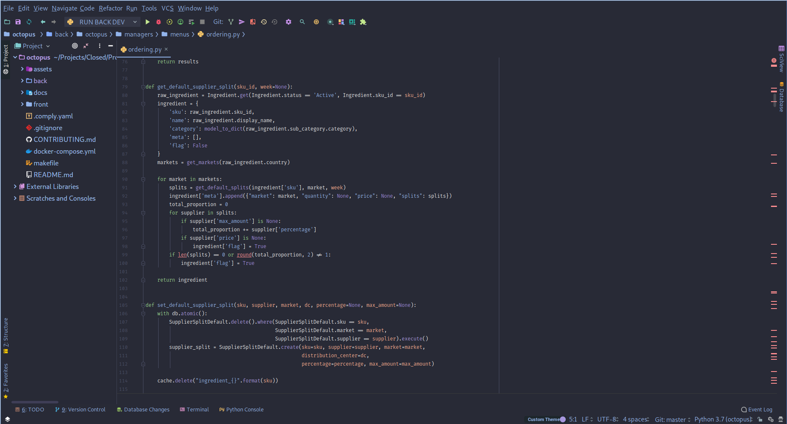

# Firark jetbrains colorscheme

The Firark jetbrains colorscheme is an implementation of the [Firark colors](https://github.com/alxkt/firark-colors) for the popular IDEs from Jetbrains, including Pycharm, Intellij IDEA and more. Download the `firark-jetbrain-editor.icls` file and import it in the settings of your favorite IDE : **Settings -> Editor -> Color Scheme** and then **Import scheme**.

